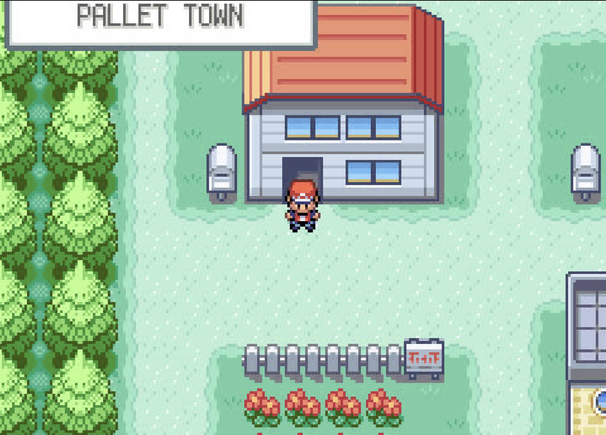

# 🎮 GB_HPC

**Play GameBoy games entirely in your terminal — on your HPC cluster.**

```
   ██████╗  █████╗ ███╗   ███╗███████╗██████╗  ██████╗ ██╗   ██╗
  ██╔════╝ ██╔══██╗████╗ ████║██╔════╝██╔══██╗██╔═══██╗╚██╗ ██╔╝
  ██║  ███╗███████║██╔████╔██║█████╗  ██████╔╝██║   ██║ ╚████╔╝
  ██║   ██║██╔══██║██║╚██╔╝██║██╔══╝  ██╔══██╗██║   ██║  ╚██╔╝
  ╚██████╔╝██║  ██║██║ ╚═╝ ██║███████╗██████╔╝╚██████╔╝   ██║
   ╚═════╝ ╚═╝  ╚═╝╚═╝     ╚═╝╚══════╝╚═════╝  ╚═════╝    ╚═╝

  ███████╗███╗   ███╗██╗   ██╗██╗      █████╗ ████████╗ ██████╗ ██████╗
  ██╔════╝████╗ ████║██║   ██║██║     ██╔══██╗╚══██╔══╝██╔═══██╗██╔══██╗
  █████╗  ██╔████╔██║██║   ██║██║     ███████║   ██║   ██║   ██║██████╔╝
  ██╔══╝  ██║╚██╔╝██║██║   ██║██║     ██╔══██║   ██║   ██║   ██║██╔══██╗
  ███████╗██║ ╚═╝ ██║╚██████╔╝███████╗██║  ██║   ██║   ╚██████╔╝██║  ██║
  ╚══════╝╚═╝     ╚═╝ ╚═════╝ ╚══════╝╚═╝  ╚═╝   ╚═╝    ╚═════╝ ╚═╝  ╚═╝
```

Ever been on your HPC, deep in analysis, thinking *"I deserve a break, but I don't want to leave my terminal"*? Same. This repo packages a full GameBoy Advance emulator into a Singularity container that renders directly in your terminal. No X forwarding, no GUI, no VNC — just your game, your terminal, and your time management skills.

Worried your admin or others are going to flag you playing games? No worries. With a discreet name and run ID labeled "critical_analysis" you'll always *appear* on top of things.

<p align="center">
  
</p>

---

> ⚠️ **This repo is actively under development — check back for updates!**
Things are pretty glitchy at the momet but im working on fixing it! 😅

---

## How It Works

The container runs [mGBA](https://mgba.io/) on a headless virtual display inside Singularity, captures frames with ffmpeg, and streams them to your terminal using the Kitty graphics protocol. Input is captured from your keyboard and forwarded to the emulator via XTEST. The display dynamically resizes to fit your terminal window.

## 🖥️ Recommended Terminal

**[iTerm2](https://iterm2.com/)** is the recommended terminal. It supports the graphics protocol used for rendering and works well over SSH to your HPC nodes.

## 🕹️ Controls

| Key | Action |
|-----|--------|
| `W` / `A` / `S` / `D` | D-Pad (Up / Left / Down / Right) |
| `L` | A Button |
| `P` | B Button |
| `E` | Start |
| `Q` | Select |
| `O` / `K` | L / R Bumpers |
| `Ctrl+C` | Quit |

## 📁 Setup

### Folder Structure

Organize your ROMs like this — one folder per game:

```
~/games/
├── pkmon_frr/
│   ├── pokemon_fire_red_U.gba
│   ├── saves/
│   ├── states/
│   └── screenshots/
└── pkmon_emr/
    ├── pokemon_emerald.gba
    ├── saves/
    ├── states/
    └── screenshots/
```

The `saves/`, `states/`, and `screenshots/` directories are created automatically on first run.

### Build the Container

```bash
sudo singularity build ga_em.sif Singularity_gb_emulator
```

### Run

```bash
# Launch with game selection menu
./critical_analysis.sh /path/to/games

# Launch a specific game directly
./critical_analysis.sh /path/to/games pkmon_frr
```

## 🔧 Requirements

- **Singularity** (or Apptainer) on your HPC
- **A GBA ROM** (`.gba` file)
- **[iTerm2](https://iterm2.com/)** (recommended)

Everything else (mGBA, xdotool, Xvfb, ffmpeg, PIL, python-xlib) is built into the container.

## 📦 What's in the Container

| Tool | Purpose |
|------|---------|
| [mGBA](https://mgba.io/) | GBA emulator (built from source) |
| [Xvfb](https://www.x.org/) | Virtual X display |
| [xdotool](https://github.com/jordansissel/xdotool) | Input forwarding |
| [ffmpeg](https://ffmpeg.org/) | Frame capture and streaming |
| [Pillow](https://pillow.readthedocs.io/) | Frame scaling and FPS overlay |
| [python-xlib](https://github.com/python-xlib/python-xlib) | Low-latency key injection via XTEST |

## In case you were wondering...

This project provides a container build for running your own legally obtained ROMs. No ROMs are included.

---

*Built for researchers who need "critical analysis" breaks.* 🧬🎮
